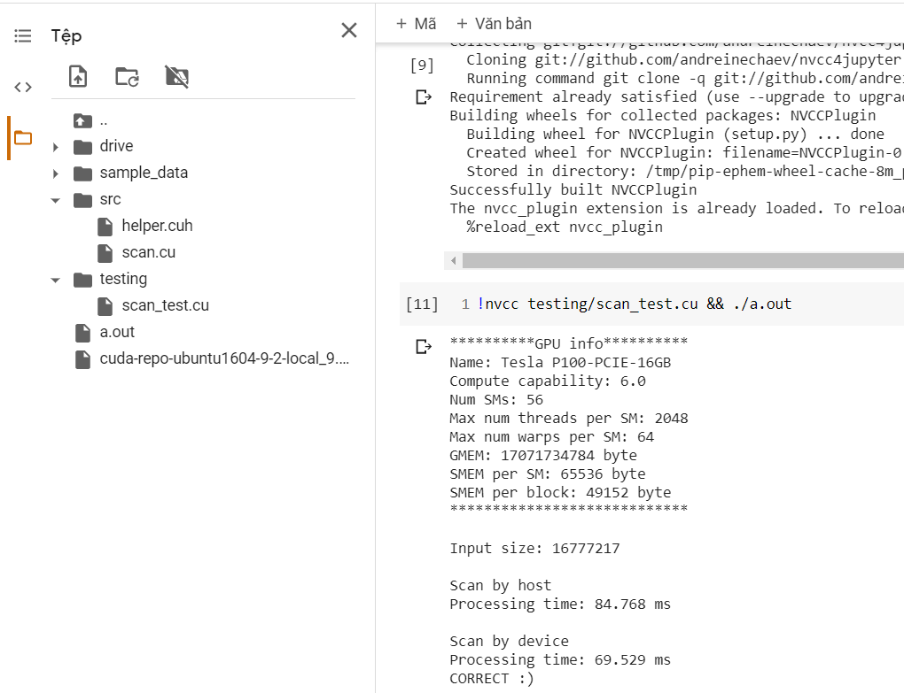

# parallel_programming

# Hướng đẫn
* Tuần này cố gắng cài lại và hiểu các bài toán scan và tính histogram
    * Nên xem lại video của thầy để làm thêm các cải tiến.
    * Cố gắng cài lại thuật toán sort của thầy chạy trên host. Xem lại bài giảng.
    * Có thời gian đọc thêm các bài báo ở thư mục papers

* Một số link tham khảo:
    * `https://github.com/mark-poscablo/gpu-radix-sort/tree/master/radix_sort`
    * `https://github.com/moderngpu/moderngpu/tree/master/src/moderngpu`
    * `https://github.com/NVlabs/cub`
    * `https://developer.nvidia.com/gpugems/gpugems2/part-vi-simulation-and-numerical-algorithms/chapter-46-improved-gpu-sorting`
    * `https://github.com/deeperlearning/professional-cuda-c-programming`

* Cấu trúc thư mục:
    * Khi code 1 bài mới ví dụ, scan. thì tạo 1 file `scan.cu`, `hits.cu` ... sau đó include ```#include "helper.cuh"``` vào file mới trong này chứ hàm `CHECK` để check `GPU` và struct `GpuTimer`. Sau đó code các hàm cần thiết không code hàm main vào các file này.
    * Sau đó vào thư mục test. tạo file test tương tự ví dụ `scan_test.cu` sau đó code lại hàm main nhớ include các file cần thiết ví dụ `#include "../src/scan.cu"`

* Để chạy code này cần upload các file trong thư mục `src` vào thực mục `src`, `testing` tạo trên colab và upload toàn bộ các file trong thư mục đó. ví dụ như hình sau:



- sau đó chạy lệnh sau trên colab

`!nvcc testing/scan_test.cu && ./a.out`

có thể tham khảo file [example](./example.ipynb)

Cấu hình máy chạy các test case

```shell
**********GPU info**********
Name: GeForce GTX 1050
Compute capability: 6.1
Num SMs: 6
Max num threads per SM: 2048
Max num warps per SM: 64
GMEM: 3221225472 byte
SMEM per SM: 98304 byte
SMEM per block: 49152 byte
****************************
```

## Tuần 13/9 - 19/9:

* 14/9 : làm thử phiên bản baseline 2:
    - tính song song hóa quá trình tính hist (done)-phiên bản bình thường. đơn giản chỉnh sửa phần tính hist dúng các bit cần tính. thử nghiệm 2 kernal sử dụng SMEM và không sử dụng SMEM.
        - Nhận thấy việc sử dụng SMEM hoặc không sử dụng SMEM không ảnh hưởng quá nhiều với quá trình sorting với blocksize = `256, 512` (k nhận thấy sự chênh lệnh thời gian quá nhiều, có thể là do nBins = 4 khá nhỏ nên việc sử dụng SMEM k đem lại hiệu quả)
        - Thời gian chạy giảm `20ms` so với phiên bản chạy trên host (`1158.377` vs `1102.379`) với cấu hình máy như trên
        - TODO chạy thử trên colab
    - song song quá trình scan (inprocess) - TODO

* 16/9 : làm thử phiên bản baseline 2:
    - song song quá trình scan (inprocess):
        - đã implement scan exclusively bằng host, chạy thử và hàm kernal đang bị lỗi.
        - nhận xét nBin = 4 khá nhỏ, có thể không hiệu quả khi tính toán bằng device. (thử các chiến lược khác trong lần tối ưu tiếp theo)
        - hàm kernal scan exclusively - TODO

* 19/9 : làm thử baseline 3:
    - song song quá trình scan 0-1
    - Scatter (inprocess) - Done

* 22/9 : làm thử baseline 3:
    - song song quá trình scan 0-1 (inprocess) - done 22-9
    - Scatter k = 1 (inprocess) - TODO
    - song song quá trình tính hist và scan trong cùng 1 kernal

* 23/9: baseline 3:
    - đã tiến hành song song phần tính hist bằng một kernal khác với các phiên bản trước là các bước cấp phát và copy thực hiện 1 lần trong hàm sort chứ k đơn giản là thực hiện gọi các hàm trong các bài trước. Kết quả `5018.378 ms` có thể là do chạy counting sort nhiều lần nên chậm hơn các phiên bản trước.
    - TODO làm phần scan song song hóa trên mảng 0-1
    - Thử cài đặt lại các bước song song của thuật toán radix cải tiến.

* 25/9: baseline 3:
    - đã tiến hành song song theo các bước trong slide 19-21 cả host code và device code kết quả thời gian chạy `4709.280 ms`
    - TODO: cải tiến phần cấp phát bộ nhớ 1 lần, hiện tại mỗi lần gọi hàm scan sẽ cấp phát bộ nhớ nhiều lần
    - TODO: k > 1
* 27/9  baseline 3:
    - đã cài đặt các bước đơn giản của thuật toán radix sort với k = 2. đã thực hiện xong bước exclusive scan
    - TODO: Mỗi block thực hiện scatter phần dữ liệu của mình xuống mảng output dựa vào kết quả scan ở trên

* 28/9  baseline 3:
    - hoàn thành bước tính exclusive scan bao gồm phần rộng hơn kernal
    - TODO:
        - tham khảo transpose ở [đây](https://github.com/JonathanWatkins/CUDA/blob/master/NvidiaCourse/Exercises/transpose/transpose.cu) để tính toán hiệu quả phần xoay hist
        - thực hiện scatter

* 29/9  baseline 3:
    - thực hiện scatter:
        - ý tưởng đùng SMEM mỗi thread sẽ tự tính rank cho phần tử mình phụ trách
        - Mỗi thread lặp từ 0 đến threadId của mình đếm có bao nhiêu phần tử nhỏ hoặc bằng mình gọi là left
        - mỗi thread lặp từ threadId của mình + 1 đến max bên phải (nhớ ngưỡng tràn block biên) đếm có bao nhiêu phần tử nhỏ mình gọi là right
        - rank[threadId] = left + right // gọi là rank nội bộ. dùng rank này cộng với vị trí bắt đầu của digit đang xét có trong mảng scans sẽ ra rank thật sự trong mảng output
    - TODO test scatter
    - TODO chạy và báo cáo kết quả
* 30/9 baseline 3:
    - test scatter Fail
    - Cần check lại hàm scatter hoặc code lại, theo ý tưởng khác

* 2/10 baseline 3:
    - fix lại cách tính rank khi scatter do hiểu lầm. Trong nội bộ mỗi block chỉ cần đếm số phần tử có digit bằng nó bên trái + với vị trí bắt đầu tương ứng trong mảng scans là sẽ ra rank thật sự
    - TODO test scatter
    - TODO chạy và báo cáo kết quả
